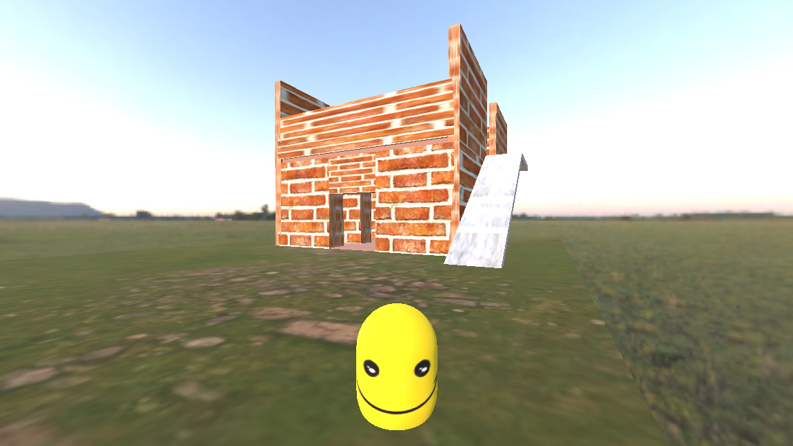

# Taller Escena - Videojuego 3D en Godot

Un videojuego 3D desarrollado con **Godot Engine 4.5** como proyecto educativo en taller. El juego presenta un mundo 3D explorable con mecánicas de movimiento y cámara de primera persona.



## 📋 Descripción del Proyecto

Este proyecto es un prototipo interactivo de videojuego 3D que demuestra conceptos de desarrollo en Godot Engine, incluyendo:

- Movimiento de personaje en 3D
- Sistema de cámara de tecera persona
- Controles de entrada personalizados (WASD)

## 🎮 Características Principales

### Control del Jugador
- **Movimiento**: Usa las teclas `W`, `A`, `S`, `D` para moverte
- **Salto**: Presiona `Espacio` para saltar
- **Cámara**: Mueve el ratón para mirar alrededor

### Mundo de Juego
- Ambiente 3D con terreno y componentes interactivos
- Casa de **dos pisos** como punto de referencia
- Texturas y assets variados (terracota, piedra, piso, etc.)
- Iluminación ambiental con HDRI (bloem_field_sunrise_1k)

## 📁 Estructura del Proyecto

```
taller-escena/
├── scripts/                 # Scripts GDScript del proyecto
│   └── player.gd           # Control del personaje principal
├── characters/             # Escenas de personajes
│   └── player.tscn         # Escena del jugador
├── game_components/        # Componentes del juego
│   └── house.tscn          # Escena de la casa
├── game_world/             # Mundos y escenarios
│   └── mundo.tscn          # Escena principal del mundo
├── levels/                 # Niveles del juego
├── models/                 # Modelos 3D
│   └── characters/
│       └── the_boss/       # Modelo del jefe
├── assets/                 # Recursos gráficos
│   ├── Texturas de terreno
│   └── environments/       # Texturas HDRI
├── ui/                     # Interfaz de usuario
├── main/                   # Escenas principales
├── addons/                 # Extensiones de Godot
└── project.godot           # Configuración del proyecto
```

## 🎯 Configuración de Entrada

El proyecto utiliza las siguientes acciones de entrada configuradas:

| Tecla | Acción | Descripción |
|-------|--------|-------------|
| W | Movimiento adelante | Mueve el personaje hacia adelante |
| A | Movimiento izquierda | Mueve el personaje a la izquierda |
| S | Movimiento atrás | Mueve el personaje hacia atrás |
| D | Movimiento derecha | Mueve el personaje a la derecha |
| Espacio | Salto | El personaje salta (si está en el suelo) |
| Ratón | Cámara | Controla la dirección de la vista |

## 🛠️ Requisitos

- **Godot Engine**: 4.5 o superior
- **Plataforma**: Windows, macOS, Linux
- **Recursos**: Se incluyen assets y texturas necesarias

## 🚀 Cómo Ejecutar

1. **Clonar el repositorio**:
   ```bash
   git clone https://github.com/sebastianmr18/taller-escena.git
   cd taller-escena
   ```

2. **Abrir en Godot Engine**:
   - Abre Godot Engine 4.5
   - Selecciona "Importar" proyecto
   - Navega a la carpeta del proyecto y selecciona `project.godot`

3. **Ejecutar el juego**:
   - Presiona `F5` o haz clic en el botón "Play" en la esquina superior derecha
   - La escena principal (`mundo.tscn`) se cargará automáticamente

## 🎨 Assets Utilizados

- **Texturas**: 
  - rocky_terrain_02_diff_1k.jpg (terreno rocoso)
  - piso.jpg (piso)
  - bircks.jpg (ladrillos)
  - feliz.jpg (decorativo del jugador)
  - stairs.jpg (escaleras)

- **Iluminación**:
  - bloem_field_sunrise_1k.hdr (Mapa HDRI de cielo/iluminación)

## 🔧 Script Principal: player.gd

El script del jugador incluye:

```gdscript
const SPEED = 5.0           # Velocidad de movimiento
const JUMP_VELOCITY = 4.5   # Fuerza del salto
var sens := 0.2             # Sensibilidad de la cámara
```

**Funcionalidades**:
- `_ready()`: Captura el ratón al iniciar
- `_physics_process()`: Maneja el movimiento y física
- `_input()`: Controla la rotación de la cámara
- `move()`: Implementa la lógica de movimiento (gravedad, salto, WASD)

## 🎓 Propósito Educativo

Este proyecto es un taller de desarrollo de videojuegos que demuestra:
- Estructura de proyecto en Godot
- Scripting en GDScript
- Sistemas de entrada y control
- Física 3D básica
- Gestión de escenas y nodos
- Importación de assets

## 📄 Licencia

Consulta el archivo [LICENSE](LICENSE) para más detalles.

## 👤 Autor

- JUAN SEBASTIAN MUÑOZ ROJAS <2177436-3743> juan.munoz.rojas@correounivalle.edu.co **(sebastianmr18)** - Desarrollador

---